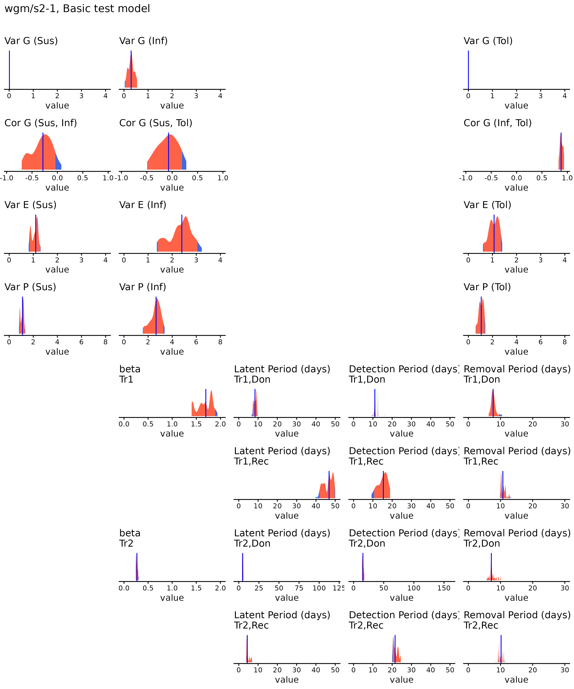

# Simulation

```{r sim-setup, include=FALSE}
knitr::opts_chunk$set(echo = TRUE, message = FALSE, warning = FALSE)
```

Pull in all the necessary libraries and source files, and two scripts for
post-processing.

```{r}
suppressPackageStartupMessages({
    source("libraries.R")
    source("source_files.R")
    source("scripts/posterior.R")
    source("scripts/km_plots.R")
})
```

# Generating a list of project parameters

The first step is to generate a project parameters list, `params`, which
contains the basic information, with some messages to note exactly what it's
using. `params` might not have everything we want, but it is just a basic R
list, so we can easily modify it afterwards.

```{r sim-params}
params <- make_parameters(dataset = "wgm",
                          name = "scen-1-1",
                          sim_new_data = "bici")

params$nchains <- 1
params$nreps <- 1
```

Next we take the `params` file, build a population, and set the groups. We're
skipping generating traits and applying fixed effects, BICI can do this for us.

```{r sim-build-popn, message=FALSE}
popn <- make_pedigree(params) |>
    set_groups(params)
```

Taking a look at what columns are in `popn`:

```{r}
names(popn)
```

Where:

-   `id`: the unique ID of the individual. Sires come first, then dams, then
    progeny.
-   `sire` and `dam` of the individual (together with `id` this makes a
    pedigree).
-   `sdp`: whether the individual is a sire, dam, or progeny.
-   The `weight` in kg at start of experiment.
-   Which `trial` the individual was assigned to.
-   Which `group` the individual was assigned to.
-   `donor`: if the individual was inoculated (1) or not (0).
-   `GE`: a small tank dependent group effect.

# Generate directories and config files

If simulating in R, we would pass the population file `popn` and the parameters
`params` to `simulate_epidemic()`, which would run the appropriate model and
return a new `popn` file with event times, etc. Instead we need to send the
files to BICI.

In order for BICI to work, it needs the data and the model to fit to the data.
We first generate the directories (all stored in the `params` file) and then
create the BICI script file.

```{r sim-generate-files, eval = FALSE}
params[str_ends(names(params), "_dir")] |>
    discard(dir.exists) |>
    walk(~ message("- mkdir ", .x)) |>
    walk(dir.create, recursive = TRUE)

# Remove any old files
# cleanup_bici_files(params)
bici_txt <- generate_bici_script(popn, params)
```

And now a quick aside as we check the relevant file...

# Run BICI

Here we build `cmd`, the command that runs BICI, and run it with `system(cmd)`.
There is some additional platform information in case the BICI directory
contains an executable compiled for each platform (`"bici-Linux"`,
`"bici-Darwin"`, or `"bici-Windows"`). If running the PAS algorithm, then BICI
needs to be compiled with MPI support, and `--output :raw` is necessary for it
to output a progress meter (otherwise it saves all output until it's finished
running).

```{r sim-build-cmd}
cmd <- with(params, str_glue(
    if (algorithm == "pas")
        "mpirun -n {nchains} --output :raw --oversubscribe " else "",
    "../BICI/bici-{platform} {data_dir}/{name}.bici {bici_cmd}",
    platform = Sys.info()[["sysname"]]
))
message(str_glue("Running:\n$ {cmd}"))
```

And call BICI

```{r sim-run-bici, eval=FALSE}
tic()
out <- system(cmd)
time_taken <- toc()
```

# Retrieve results and save

```{r sim-retrieve-results}
c("params", "popn", "time_taken") |>
    keep(exists) |>
    mget() |>
    saveRDS(file = with(params, str_glue("{results_dir}/{name}.rds")))
```

Finally `flatten_bici_states()` creates an `etc-sim.rds`, summary file that
contains all the parameters and a `popn` data.table with all the necessary
columns for traits and event times. ("ETC" comes from "Extended Trace Combined",
from when Chris's older software created regular and extended trace files).

For `bici_cmd="inf"` this would be a number of samples of the posterior,
including all genetic traits. Note that this can take a long time to run if
there are a lot of states.

```{r sim-flatten-states, eval = FALSE}
with(params, flatten_bici_states(dataset, name, bici_cmd))
```

# Plotting

First a plot of the time series, to check that BICI's output makes sense.

```{r sim-plot-ts}
x <- readRDS("datasets/wgm/data/scen-1-1-out/etc_sim.rds")
popn <- x$popn[state == 1]
params$tmax <- popn[sdp == "progeny", max(Tdeath, na.rm = TRUE), trial] |>
    _[, setNames(ceiling(V1), str_c("t", trial))]
plot_model(popn, params)
```

Also a KM plot of the survival curves for each family.

```{r sim-plot-km, warning=FALSE}
basic_km(popn, params)
```

# Inference

Next up we're going to take the output of what we generated in BICI, and pass it
back to BICI to run inference. First back up the old `params` file.

```{r inf-copy}
params_sim <- params
```

and create a fresh one (or we could modify the old one too) and patch it.

```{r inf-params, results="hide"}
params <- make_parameters(dataset = "wgm",
                          name = "scen-2-1",
                          sim_new_data = "etc_sim")

# Important!
params$patch_dataset <- "wgm"
params$patch_scenario <- "scen-1-1"
params$patch_state <- TRUE

# These are for doing a very quick local run of BICI, the actual values should
# be much higher if doing a real run on Eddie.
params$nchains <- 2L # 16L
params$nsample <- 1e4L # 2e6L
params$sample_states <- 10L # 1e3L

# We also set the time_step to 1
params$time_step <- 1

params2 <- params |>
    patch_params() |>  # Patch params with posteriors from dataset / scenario
    set_use_flags() |> # Ensure priors are correctly enabled
    apply_links()      # Fix any traits that need to be linked
params <- params2

rf <- with(params, str_glue("datasets/{patch_dataset}/data/",
                            "{patch_name}-out/{sim_new_data}.rds"))
popn <- readRDS(rf)$popn[state == max(params$patch_state, 1L), .SD, .SDcols = -1]
```

# Prepare the BICI script

```{r inf-generate-files}
params[str_ends(names(params), "_dir")] |>
    discard(dir.exists) |>
    walk(~ message("- mkdir ", .x)) |>
    walk(dir.create, recursive = TRUE)

# Remove any old files
# cleanup_bici_files(params)
bici_txt <- generate_bici_script(popn, params)
```

# Run BICI

First we create the command that we'd run on the command line

```{r inf-make-cmd}
cmd <- with(params, str_glue(
    if (algorithm == "pas")
        "mpirun -n {nchains} --output :raw --oversubscribe " else "",
    "../BICI/bici-{platform} {data_dir}/{name}.bici {bici_cmd}",
    platform = Sys.info()[["sysname"]]
))
message(str_glue("Running:\n$ {cmd}"))
```

And call BICI

```{r, inf-run-bici, eval=FALSE}
tic()
out <- system(cmd)
time_taken <- toc()
```

# Retrieve results and save

Finally we collect the output from BICI do some post-processing, and save the
results in a format suitable for easily reading back in R. The results file
contains the data, the model fitted to the data, summary statistics, prediction
accuracies (if available), and the time taken to run (handy for determining how
long to reserve on Eddie for future runs with possibly more samples).

`rebuild_bici_posteriors()` creates a `trace_combine.tsv` file that contains the
output of all the chains combined into one, with the burn-in period removed,
making it immediately useful for working with and sampling from the posterior.
It also creates a summary file with each parameter's mean, median, 95% CI, 95%
HPDI, ESS, and GR, which is very useful for convergence diagnostics.

```{r inf-save-results}
{
    name <- params$name
    dataset <- params$dataset
    output_dir <- params$output_dir
    results_dir <- params$results_dir
    bici_cmd <- params$bici_cmd
}

parameter_estimates <- rebuild_bici_posteriors(dataset, name)

ebvs_name     <- str_glue("{output_dir}/ebvs.csv")
estimated_BVs <- if (file.exists(ebvs_name)) fread(ebvs_name)

pa_name   <- str_glue("{output_dir}/pred_accs.csv")
pred_accs <- if (file.exists(pa_name)) fread(pa_name)

ranks <- if (!is.null(estimated_BVs)) get_ranks(popn, estimated_BVs, params)

message("Parameter estimates:")
msg_pars(parameter_estimates)

c("params", "popn", "time_taken",
  "parameter_estimates", "estimated_BVs","ranks", "pred_accs") |>
    keep(exists) |>
    mget() |>
    saveRDS(file = str_glue("{results_dir}/{name}.rds"))
```

Finally call `flatten_bici_states()` to create the `etc-inf.rds` file.

```{r, eval=FALSE}
flatten_bici_states(dataset, name, bici_cmd)
```

# Plotting

Now we can examine the output of BICI more closely.

```{r generate-posterior, eval=FALSE, fig.show="hide"}
out <- get_posterior("wgm", 2, 1)
```



The output is pretty poor, as we used only `n=1e4` samples, but it's enough to
get the idea.

# Posterior Simulation

This is easy, we just repeat the previous results but call BICI with `post-sim`
instead of `inf`.

```{r ps-run-bici, eval=FALSE}
params$bici_cmd <- "post-sim"

cmd <- with(params, str_glue(
    if (algorithm == "pas")
        "mpirun -n {nchains} --output :raw --oversubscribe " else "",
    "../BICI/bici-{platform} {data_dir}/{name}.bici {bici_cmd}",
    platform = Sys.info()[["sysname"]]
))
message(str_glue("Running:\n$ {cmd}"))

tic()
out <- system(cmd)
time_taken <- toc()

with(params, flatten_bici_states(dataset, name, bici_cmd))
```

# KM plots

```{r, ps-km}
km_plots(dataset = "wgm",
         scens = 2,
         simulate_new_data = "no",
         opts = list(n_plots = 50,
                     post = "sample"))
```


